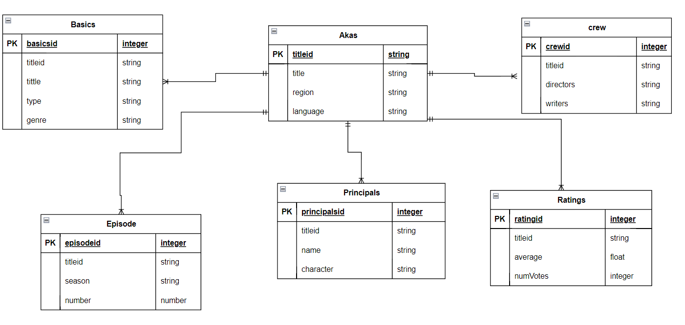

# Tarea #3 BDR
## Instrucciones
1. Crea un esquema del modelo relacional de tu base de datos a partir del modelo relacional de tu base de datos a partir del e-r de la tarea anterior.
2. Representa con un diagrama relacional tu esquema del punto anterior.
3. Encuentra 4 operaciones que vayas a usar en tu base de datos y expresalas mediante operadores del algebra relacional. Explica con tus propias palabras cada una de estas operaciones.
4. Reporta tu tarea de una manera claramente identificable en el repositorio.

## IMDB Database Schema

### Modelo relacional
 - Akas(<ins>titleid</ins>, title, region, language)
 - Basics(<ins>basicsid</ins>, titleid, title, type, genres)
 - Crew (<ins> crewid </ins>, titleid, directors, writers)
 - Episode(<ins>episodeid </ins>, titleid, season, number)
 - Principals(<ins>pricipalid</ins>, titleid, name, character)
 - Ratings(<ins>ratingid</ins>, titleid, average, numVotes)

 ### Diagrama Entidad Relación.

### Operaciones.
#### Títulos con Rating Mayor a 4.4
\[ \pi_{\text{title}} \left( \sigma_{\text{averageRating} > 4.4}(\text{title.ratings} \bowtie \text{title.basics}) \right) \]
