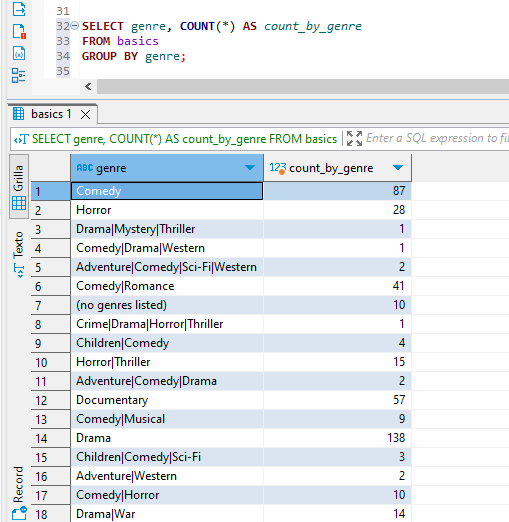
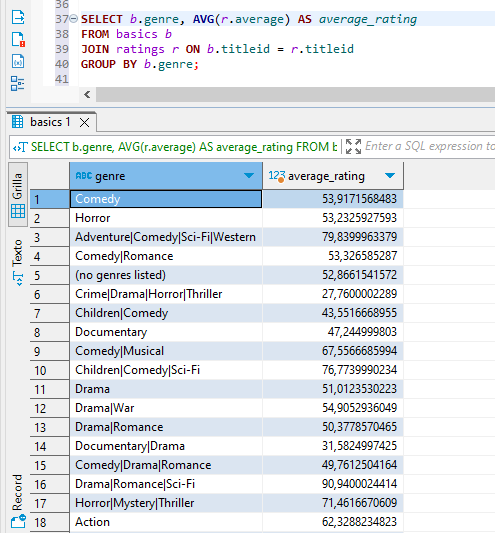
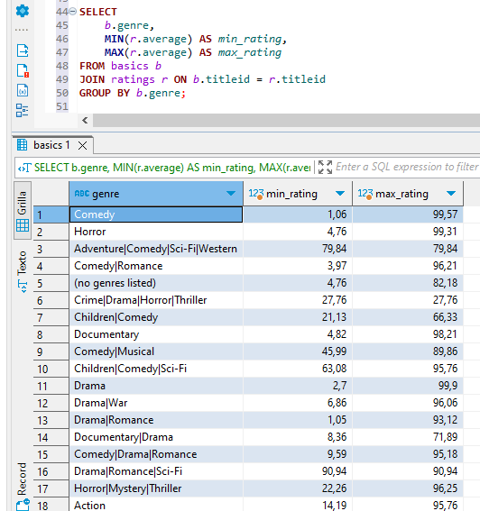
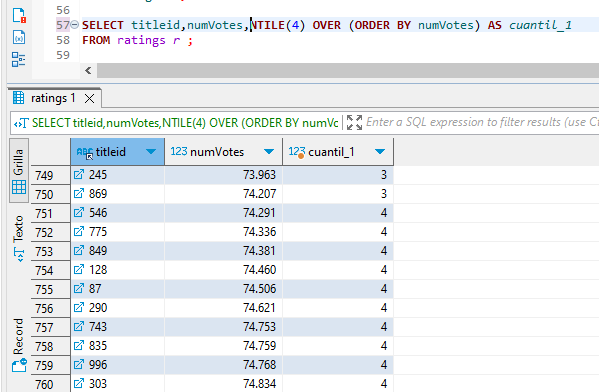
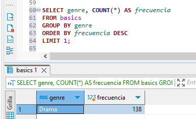

# Informe - Tarea 6

En esta tarea, se llevaron a cabo diversas operaciones en la base de datos "imdb". A continuación, se presenta un resumen de las operaciones realizadas y sus resultados:

## Función 1: Conteo de frecuencias o media
### Frecuencias.
Se obtuvo cuantas peliculas hay por cada genero:

### Media.
Se obtuvo la media en puntuaciones de cada genero de pelicula:

## Función 2: Minimos o Maximos.
Se obtuvo el maximo y minimo de calificación de cada genero.

## Función 3: Cuantil
Se ubicaron los cuantiles usando el numero de votos de cada pelicula.

## Función 4: Moda
Se busco el genero de pelicula que mas se encuentra.

### Dificultades
La mayor dificultad que se encontro durante la realización de esta actividad fue la realización de la función 3. Muchas de las funciones para obtener cuantiles no funcionaban adecuadamente.
